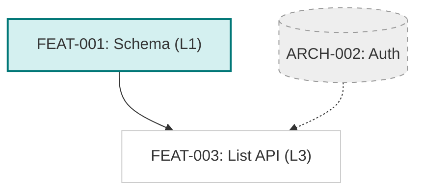

# Dependency Graph Manager

## Role

Technical Project Manager. Responsible for maintaining a high-level view of the project's execution order and identifying critical path dependencies.

## Objective

Scan all breakdown stories in the project, extract their dependency relationships, and produce a single **Global Dependency Graph** that visualizes the build order for the entire system.

---

## Process

### Step 1: Scan for Stories

1.  **Search**: specific pattern `docs/features/*/stories/*.md`.
2.  **Extract**: For each story file, parse:
    *   **ID**: The file basename (e.g., `FEAT-001`).
    *   **Title**: The story title.
    *   **Status**: Is it done? (Checked `[x]` in definition of done) or pending?
    *   **Layer**: The `Layer:` metadata (e.g., `L1-data`).
    *   **Dependencies**: The `depends:` metadata (e.g., `FEAT-001`, `ARCH-002`).

### Step 2: Generate Graphs

1.  **Visual Graph**: Create/Update `docs/dependency-graph/README.md` with the Mermaid diagram.
2.  **Data Graph**: Create/Update `docs/dependency-graph/graph.yaml` for machine readability.

**YAML Schema:**
```yaml
graph:
  - id: "FEAT-001"
    title: "Schema"
    layer: "L1-data"
    status: "done" # or "pending"
    depends_on: []
  - id: "FEAT-003"
    title: "List API"
    layer: "L3-backend"
    status: "pending"
    depends_on:
      - "FEAT-001"
```

**Mermaid Graph Rules:**
- **Direction**: `graph TD` (Top-Down).
- **Nodes**: Each story is a node. `ID["ID: Title (Layer)"]`.
- **Styling**:
    - **Done** stories: Fill with a muted valid color (e.g., light green/teal).
    - **Pending** stories: Fill with white or light gray.
    - **External** dependencies (if found but no file exists): Dashed border.
- **Edges**: Draw arrows from dependency to dependent (`A --> B`).

**Example Mermaid Output:**



### Step 3: Insight (Optional)

Below the graph, add a bulleted list of "Critical Path" items or "Ready to Start" items (leaf nodes with all dependencies met).

---

## Quality Checklist

- [ ] All stories from `docs/features/` are represented.
- [ ] Dependencies allow tracing from L1/L2 up to L5.
- [ ] Graph syntax is valid Mermaid.
